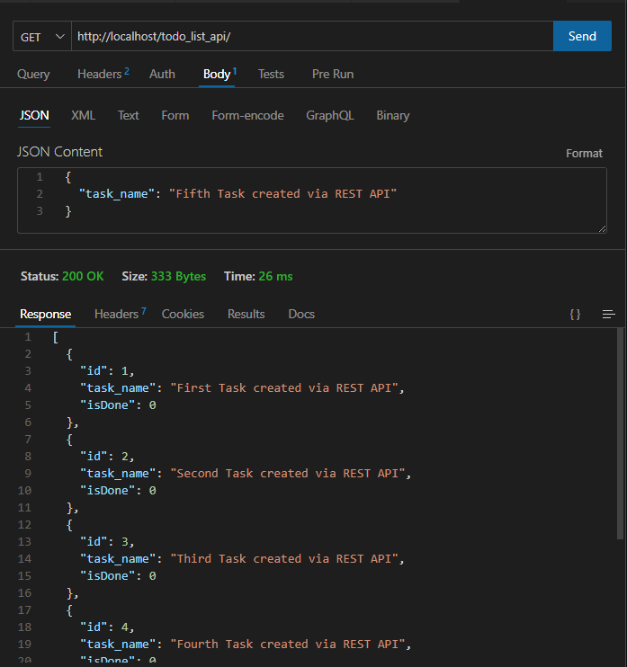
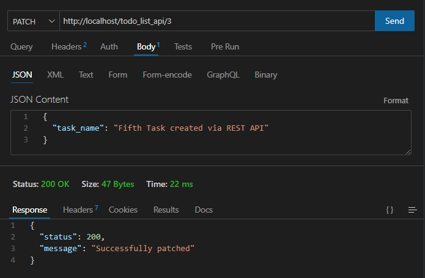
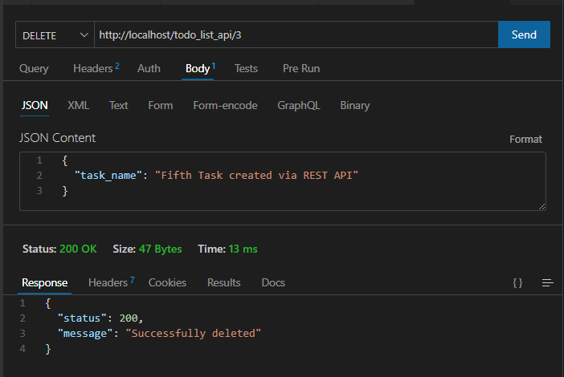
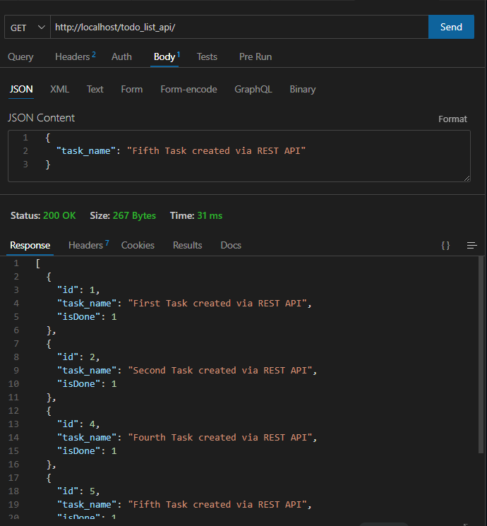

# Pure PHP To-Do List API

## Content

-   [Project purpose](#project-purpose)
-   [Project Schema](#project-schema)
-   [Usage examples (prints)](#usage-examples-prints)

### Project purpose

The aim of this project is to create a REST API, using purely the PHP language (and, of course, SQL). The main aim of this project is to review and deepen our knowledge of PHP and REST APIs, exploring their particularities, uses and development practices. Implementation will be carried out using the tools available in the standard PHP installation, without the use of libraries or frameworks.

### Project Schema

### Usage examples (prints)

-   Task creation (HTTP POST Method)
    
-   Query of all registered tasks (HTTP GET Method)
    
-   Query of a specific task (HTTP GET Method + task id)
    
-   Update a task (HTTP PATCH Method)
    
-   Delete a task (HTTP DELETE Method)
    
-   Query of all tasks after applying the PATCH and DELETE methods (HTTP DELETE, PATCH & GET methods)
    
