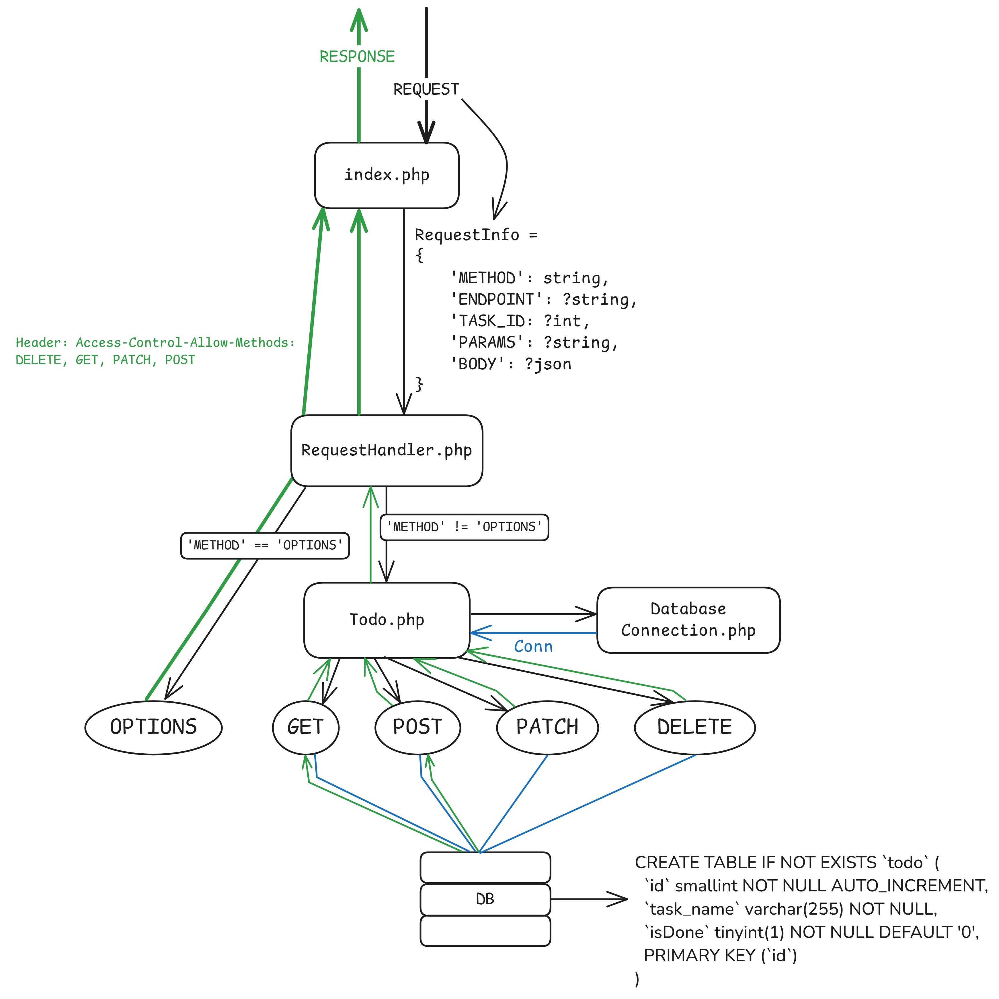
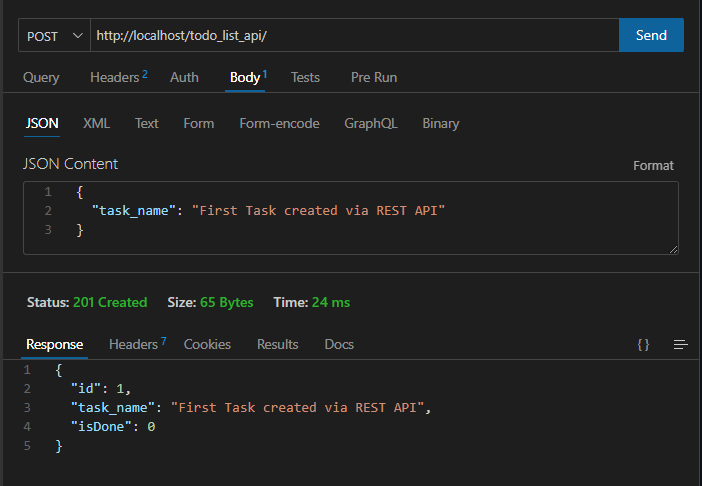
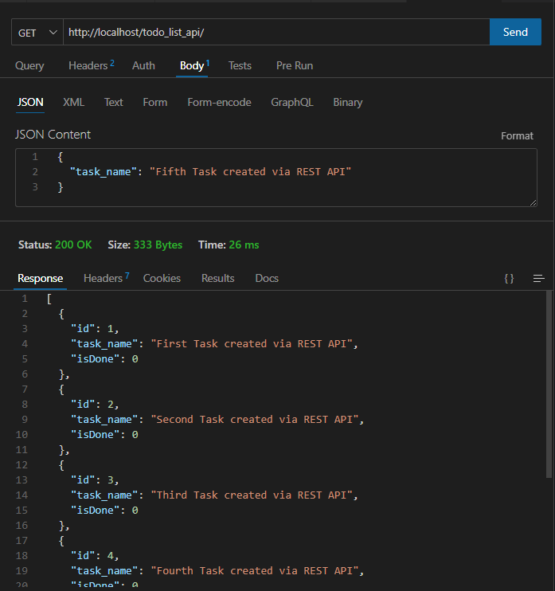
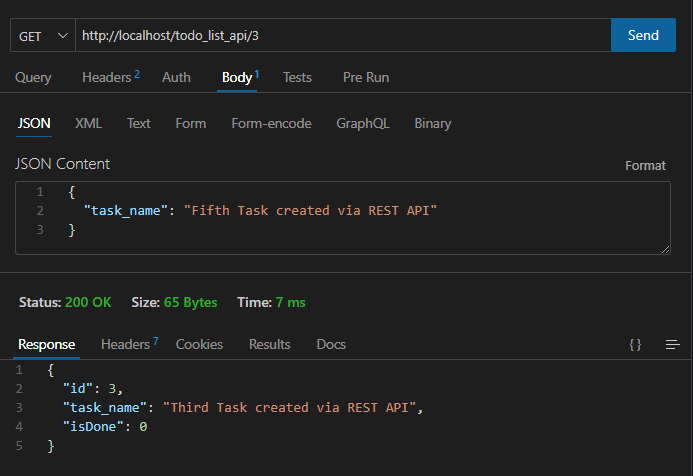
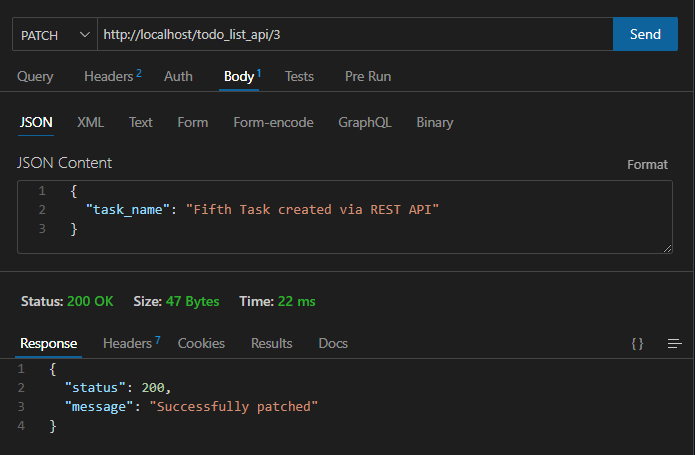
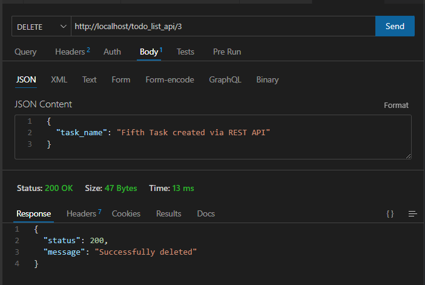
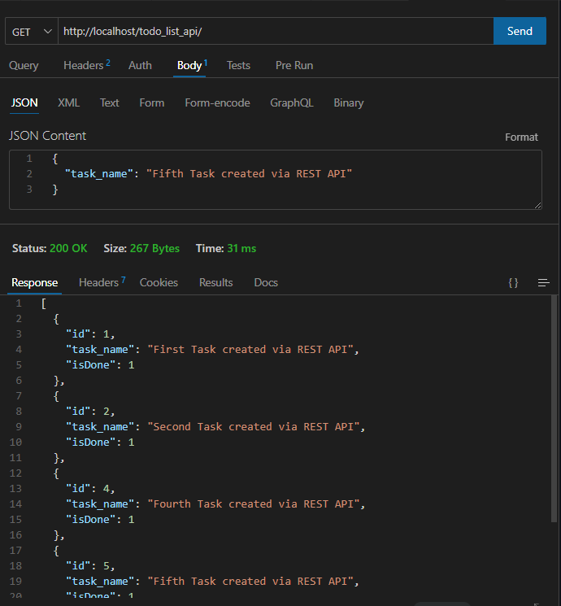

# _API REST_ de uma lista _To-Do_ em _PHP_ Puro

## Conteúdo

-   [Propósito do projeto](#propósito-do-projeto)
-   [Esquema do Projeto](#esquema-do-projeto)
-   [Exemplos de uso (_prints_)](#exemplos-de-uso-prints)

### Proposta e Propósito do projeto

A proposta deste projeto é criar uma _API REST_, usando puramente da linguagem _PHP_ (e, evidentemente, _SQL_). Este projeto tem como finalidade principal: revisar e aprofundar conhecimentos sobre PHP e _APIs REST_, explorando suas particularidades, usos e práticas de desenvolvimento. A implementação será realizada com as ferramentas disponíveis na instalação padrão do _PHP_, sem o uso de bibliotecas ou _frameworks_.

### Esquema do Projeto

### Exemplos de uso (_prints_)

-   Criação de tarefas (Método _HTTP POST_)
    
-   Consulta de tarefas (Método _HTTP GET_)
    
-   Consulta de tarefa (Método _HTTP GET_ + _Id_)
    
-   Alteração de tarefa (Método _HTTP PATCH_)
    
-   Exclusão de tarefa (Método _HTTP DELETE_)
    
-   Consulta de tarefas após aplicação dos métodos _PATCH_ e _DELETE_ (Métodos _HTTP_: _DELETE, PATCH & GET_)
    
